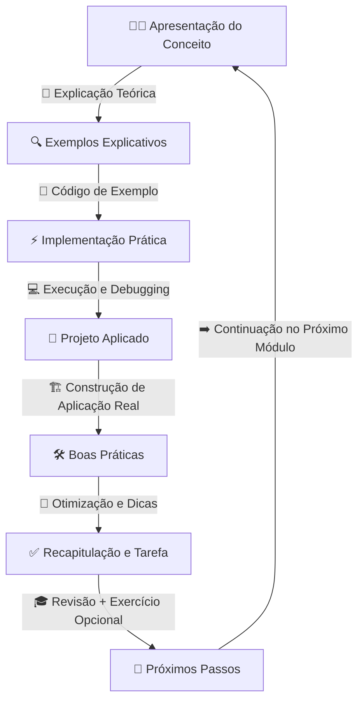

# 🤖 AI for JavaScript and TypeScript Developers - Zero to Hero

  

## 📚 Visão geral do curso  

Bem-vindo a um curso gratuito e abrangente, projetado para conectar o desenvolvimento em JavaScript and TypeScript ao mundo da Inteligência Artificial. Este curso capacita desenvolvedores de todos os níveis a explorar e aplicar o poder da IA em seus projetos.

## ✨ O que torna este curso especial?

- 💻 **Foco prático**: Cada módulo termina com um projeto do mundo real para aplicar os conhecimentos adquiridos.  

- 📈 **Aprendizado progressivo**: Comece pelos conceitos fundamentais e avance gradualmente para implementações mais avançadas.  

- 🔄 **Sempre atualizado**: O conteúdo do curso evolui continuamente para acompanhar o cenário dinâmico da IA.  

- 🎯 **Específico para linguagem**: Todos os conceitos são ensinados com aplicação direta no desenvolvimento em JavaScript/TypeScript.  

- 🔍 **Projetos práticos**: Construa aplicações reais utilizando tecnologias de IA.  

- 🌍 **Comunidade engajada**: Participe de uma comunidade vibrante de alunos e desenvolvedores para compartilhar insights e soluções.

## 👥 Para quem é este curso?

Seja você um iniciante buscando entender como a IA pode aprimorar suas aplicações ou um desenvolvedor experiente que deseja adicionar recursos de IA ao seu conjunto de ferramentas, este curso oferece o conhecimento e as habilidades práticas de que você precisa.

## 📌 Recursos usados no curso  

Para garantir uma experiência prática e acessível para todos os alunos, utilizaremos ferramentas e tecnologias amplamente usadas no ecossistema de desenvolvimento moderno. Durante o curso, você aprenderá a configurar e utilizar os seguintes recursos:

### 🛠️ Ferramentas e tecnologias principais  
  
  O **VS Code** será o nosso principal ambiente de desenvolvimento. Ele oferece suporte completo a **JavaScript/TypeScript**, extensões poderosas e integração direta com o GitHub.

- **[GitHub Copilot](https://github.com/features/copilot/?WT.mc_id=javascript-00000-gllemos)** 🤖 ✍️  
  
  Utilizaremos o **GitHub Copilot**, uma ferramenta de **IA para autocompletar código**, acelerar a escrita de funções e gerar exemplos automaticamente. Agora, há uma versão **[gratuita](https://docs.github.com/pt/copilot/managing-copilot/managing-copilot-as-an-individual-subscriber/about-github-copilot-free/?WT.mc_id=javascript-00000-gllemos)**, tornando mais acessível a mais desenvolvedores(as).

- **[GitHub Models](https://docs.github.com/pt/github-models/prototyping-with-ai-models/?WT.mc_id=javascript-00000-gllemos)** ⚡🔬  
  
  Com o **GitHub Models**, você poderá acessar diferentes modelos de forma gratuita (sem ser em produção). Você aprenderá a utilizá-los em diversos casos práticos ao longo do curso.

- **[TypeScript](https://www.typescriptlang.org/)** ⌨️  
  
  O curso será baseado principalmente em **TypeScript** devido à sua forte tipagem e melhor manutenção de código em projetos de IA. Se você já programa em **JavaScript**, a transição será tranquila.

- **[Node.js](https://nodejs.org/)** 🚀  
  
  O **Node.js** será a base para rodarmos nossos exemplos práticos, permitindo a integração direta com APIs de IA e execução de scripts no ambiente backend.

### 🔹 Outras ferramentas e tecnologias que podem ser úteis  

Dependendo do nível de aprofundamento, também exploraremos algumas dessas ferramentas e bibliotecas:

- **[LangChain.js](https://js.langchain.com/docs/introduction/)** 🦜 → Para criar aplicações de IA mais complexas, como agentes conversacionais e fluxos estruturados.  
  
- **[LlamaIndex.ts](https://ts.llamaindex.ai/)** 🦙 → Para conectar LLMs a bases de dados e construir sistemas de busca aprimorados (Retrieval-Augmented Generation - RAG).  
  
- **[Azure OpenAI Service](https://learn.microsoft.com/azure/ai-services/openai/?WT.mc_id=javascript-00000-gllemos)** ☁️ → Para consumir modelos avançados da OpenAI diretamente no **Azure**, garantindo escalabilidade e segurança. E, claro, caso deseje colocar o seu projeto em produção.
  
- **[Hugging Face Transformers](https://huggingface.co/docs/transformers/index)** 🤗 → Para explorar modelos open-source caso você queira ir além do ecossistema Azure/OpenAI.
   
- **[Deno](https://deno.com/)** 🦕 (Opcional) → Para quem deseja explorar uma alternativa ao Node.js no desenvolvimento de aplicações TypeScript modernas.  

## 💡 Por que essas ferramentas?

Essas ferramentas foram escolhidas para garantir que qualquer desenvolvedor JavaScript/TypeScript possa **testar e aprender IA sem precisar investir em infraestrutura pesada ou soluções pagas**. Durante o curso, apresentaremos cada recurso no momento apropriado, com **passo a passo de instalação e configuração**.

Se você ainda não está familiarizado com algumas dessas ferramentas, não se preocupe! Vamos guiá-lo(a) na configuração e no uso de cada uma ao longo do curso. 🚀

> [!NOTE]  
> À medida que você avança no curso, pode se deparar com algumas ferramentas que não são totalmente gratuitas. No entanto, sempre que possível, ofereceremos alternativas gratuitas ou versões de teste para que todos possam acompanhar o conteúdo sem barreiras. Além disso, novas ferramentas gratuitas podem surgir ao longo do curso, e iremos incorporá-las sempre que forem relevantes.

## 📅 Módulos do Curso

> [!NOTE]
> _A ser lançado em breve. Segunda semana de Março de 2025 (módulo 1)._

## Nível Básico

<b>Módulo 1: Introdução à Inteligência Artificial</b>

- [Episódio 1.1: O Jogo Mudou - A Revolução da IA](./lessons/01-module/README.md#episodio-1-o-jogo-mudou---a-revolucao-da-ia)
- [Episódio 1.2: Episódio 1.2: Explorando Modelos Open-Source de IA](./lessons/01-module/README.md#episodio-2-explorando-modelos-open-source-de-ia)
- [Episódio 1.3: Arquitetura de LLMs para Desenvolvedores](./lessons/01-module/README.md#episodio-2-arquitetura-de-llms-para-desenvolvedores)
- [Episódio 1.4: Fundamentos Práticos de LLMs](./lessons/01-module/README.md#episodio-3-fundamentos-praticos-de-llms)
- [Episódio 1.5: Navegando pelo Ecossistema de IA](./lessons/01-module/README.md#episodio-4-navegando-pelo-ecossistema-de-ia)  
- [Episódio 1.6: Fundamentos de Prompt Engineering](./lessons/01-module/README.md#episodio-5-fundamentos-de-prompt-engineering)
- [Episódio 1.7: Técnicas Avançadas de Prompting](./lessons/01-module/README.md#episodio-6-tecnicas-avancadas-de-prompting)

<b>Módulo 2: Nível Básico - Fundamentos Práticos</b>

- [Episódio 2.1: Setup do Ambiente de Desenvolvimento](./lessons/02-module/README.md#episodio-1-setup-do-ambiente-de-desenvolvimento)
- [Episódio 2.2: Fundamentos do Azure OpenAI SDK](./lessons/02-module/README.md#episodio-2-fundamentos-do-azure-openai-sdk)
- [Episódio 2.3: Text Completions Fundamentais](./lessons/02-module/README.md#episodio-3-text-completions-fundamentais)
- [Episódio 2.4: Executando os Exemplos de Text Completions](./lessons/02-module/README.md#episodio-4-executando-os-exemplos)
- [Episódio 2.5: Fundamentos do Gerenciamento de Respostas da Azure OpenAI](./lessons/02-module/README.md#episodio-5-fundamentos-do-gerenciamento-de-respostas-da-azure-openai)
- [Episódio 2.6: Implementando o Gerenciamento de Respostas](./lessons/02-module/README.md#episodio-6-implementando-o-gerenciamento-de-respostas)
- [Episódio 2.7: Fundamentos da Geração de Imagens com DALL-E](./lessons/02-module/README.md#episodio-7-fundamentos-da-geracao-de-imagens-com-dall-e)
- [Episódio 2.8: Implementando DALL-E na Prática](./lessons/02-module/README.md#episodio-8-implementando-dall-e-na-pratica)
- [Episódio 2.9: Processamento de Áudio - Fundamentos](./lessons/02-module/README.md#episodio-9-processamento-de-audio---fundamentos)
- [Episódio 2.10: Implementação Prática de Processamento de Áudio](./lessons/02-module/README.md#episodio-10-implementacao-pratica-de-processamento-de-audio)
- [Episódio 2.11: Os Fundamentos do Text-to-Speech](./lessons/02-module/README.md#episodio-11-os-fundamentos-do-text-to-speech)
- [Episódio 2.12: Implementação Prática de Text-to-Speech](./lessons/02-module/README.md#episodio-12-implementacao-pratica-de-text-to-speech)
- [Episódio 2.13: Speech-to-Text com Azure OpenAI - Fundamentos do Modelo Whisper](./lessons/02-module/README.md#episodio-13-speech-to-text-com-azure-openai---fundamentos-do-modelo-whisper)
- [Episódio 2.14: Implementação Prática de Speech-to-Text com Whisper](./lessons/02-module/README.md#episodio-14-implementacao-pratica-de-speech-to-text-com-whisper)
- [Episódio 2.15: Fundamentos de Embeddings com Azure OpenAI](./lessons/02-module/README.md#episodio-15-fundamentos-de-embeddings-com-azure-openai)
- [Episódio 2.16: Implementação Prática de Embeddings](./lessons/02-module/README.md#episodio-16-implementacao-pratica-de-embeddings)
- [Episódio 2.17: Vision - Fundamentos Teóricos](./lessons/02-module/README.md#episodio-17-vision---fundamentos-teoricos)
- [Episódio 2.18: Vision - Implementação Prática](./lessons/02-module/README.md#episodio-18-vision---implementacao-pratica)
- [Episódio 2.19: Function Calling - Fundamentos Teóricos](./lessons/02-module/README.md#episodio-19-function-calling---fundamentos-teoricos)
- [Episódio 2.20: Function Calling - Implementação Prática](./lessons/02-module/README.md#episodio-20-function-calling---implementacao-pratica)
- [Episódio 2.21: Reasoning - Fundamentos dos Modelos de Raciocínio](./lessons/02-module/README.md#episodio-21-reasoning---fundamentos-dos-modelos-de-raciocinio)
- [Episódio 2.22: Reasoning - Implementação Prática](./lessons/02-module/README.md#episodio-22-reasoning---implementacao-pratica)
- [Episódio 2.23: Structured Outputs - Fundamentos Teóricos](./lessons/02-module/README.md#episodio-23-structured-outputs---fundamentos-teoricos)
- [Episódio 2.24: Structured Outputs - Implementação Prática](./lessons/02-module/README.md#episodio-24-structured-outputs---implementacao-pratica)
- [Episódio 2.25: Predicted Outputs - Fundamentos Teóricos](./lessons/02-module/README.md#episodio-25-predicted-outputs---fundamentos-teoricos)
- [Episódio 2.26: Predicted Outputs - Implementação Prática](./lessons/02-module/README.md#episodio-26-predicted-outputs---implementacao-pratica)

## Nível Intermediário: Aplicações Práticas

<b>Módulo 3: Streaming e Integrações</b>

- [Fundamentos de Streaming em IA](#)  
- [Chat com Streaming](#)  
- [Streaming com WebSockets e Server-Sent Events](#)  
- [Implementando Filtros de Conteúdo](#)  
- [Integração de Dados Customizados](#)  
- [Monitoramento de Fluxo de Dados em IA](#)  

<b>Módulo 4: Assistants AI</b>

- [Fundamentos de Assistants AI](#)  
- [Criando Assistants AI com OpenAI](#)  
- [Gerenciamento de Memória e Histórico de Conversas](#)  
- [Implementação de Assistente com Ferramentas Customizadas](#)  
- [Aprimorando Assistentes com APIs Externas](#)  
- [Segurança e Controles de Acesso em Assistants](#)  

## Nível Avançado: Sistemas Complexos

<b>Módulo 5: RAG e Frameworks Avançados</b>

- [Fundamentos de RAG](#)  
- [Implementação Prática de RAG](#)  
- [Armazenamento de Dados para RAG (Pinecone, Weaviate e Qdrant)](#)  
- [LangChain.js Essencial](#)  
- [LangChain.js Avançado](#)  
- [Implementação Prática com LangChain.js](#)  
- [LlamaIndex.ts Essencial](#)  
- [LlamaIndex.ts Avançado](#)  
- [Implementação Prática com LlamaIndex.ts](#)  
- [Fine-tuning em Produção](#)  

<b>Módulo 6: AI Agents e Automação</b>

- [Arquitetura de AI Agents](#)
- [Function Calling na Prática](#)
- [Code Interpreter](#)
- [Projeto com AI Agents](#)

<b>Módulo 7: Produção e Segurança</b>

- [Segurança em Sistemas de IA](#)  
- [Privacidade e Ética](#)  
- [Ataques Comuns e Como Mitigar (Prompt Injection, Jailbreak, Data Poisoning)](#)  
- [Performance e Escala](#)  
- [Monitoramento em Produção](#)  

<b>Projeto Final: Sistema Completo</b>

- [Design e Arquitetura](#)  
- [Implementação de RAG](#)  
- [Integração de AI Agents](#)  
- [Deploy Seguro](#)  
- [Monitoramento e Otimização](#)  
- [Testes e Debugging em Sistemas de IA](#)  

---

## 📝 Como será o fluxo do curso?  

Para garantir um aprendizado eficiente, cada **exemplo prático** seguirá uma estrutura clara:  

1️⃣ **Explicação teórica** → Antes de cada exemplo, sempre teremos uma parte teórica para contextualizar o conceito que será abordado.

2️⃣ **Código de exemplo** → Após a teoria, veremos a implementação prática do conceito em TypeScript.

3️⃣ **Projetos práticos** → Quando trabalharmos em projetos completos, haverá uma aula dedicada cobrindo **desde a configuração inicial até o desenvolvimento completo**, garantindo que todos os detalhes sejam bem compreendidos.

4️⃣ **Dicas e Boas Práticas** → Ao longo do curso, compartilharemos dicas valiosas e boas práticas para otimizar seu processo de desenvolvimento e aprimorar a qualidade do seu código.

Sempre que possível, utilizaremos **GitHub Copilot** para demonstrar como essa ferramenta pode acelerar o desenvolvimento e melhorar a qualidade do código.

Abaixo, você pode ver um diagrama que ilustra o fluxo do curso:

## ❗️Links & Recursos Importantes

TBI

## ❓Tenho Dúvidas... O que Faço?!

Caso tenham dúvidas aos códigos desenvolvidos durante a série de vídeos, sintam-se à vontade em abrir uma [ISSUE AQUI](https://github.com/glaucia86/ai-js-course/issues). Assim que possível, estaremos respondendo a todas as dúvidas que tiverem!

